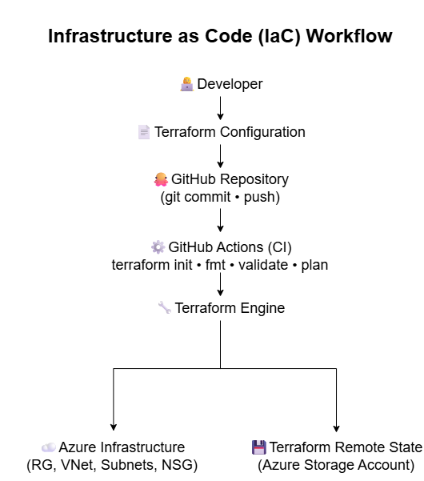
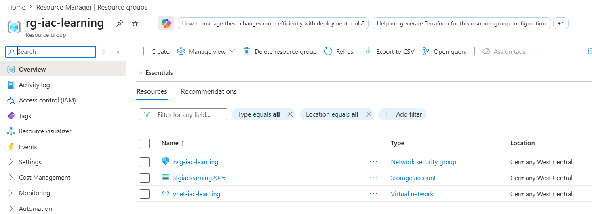
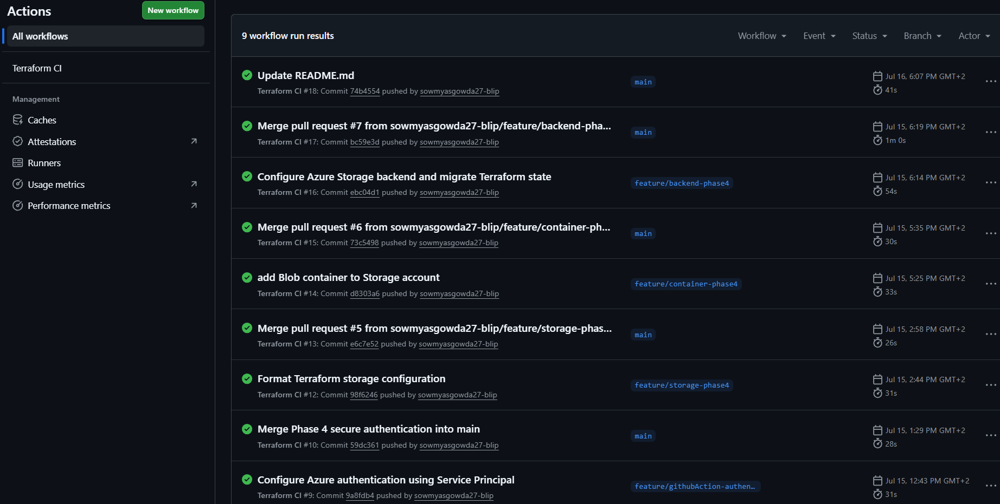

# Azure Infrastructure as Code (IaC) with Terraform

## Project Overview

I created this project to understand how Infrastructure as Code (IaC) is developed and managed using Terraform on Microsoft Azure.

Rather than building a large production environment, this project focuses on the engineering practices behind Infrastructure as Code. It demonstrates how Terraform, Git, GitHub, GitHub Actions, remote state management, and secure authentication work together to manage cloud infrastructure using industry-standard workflows.

As my understanding grew, I refined this learning project into a portfolio project to showcase the practical skills and workflows I gained throughout the journey.

---

## Project Objectives

- Learn Infrastructure as Code (IaC) using Terraform
- Understand how Terraform manages cloud infrastructure
- Build a modular and maintainable Terraform project
- Learn Git and GitHub workflows for infrastructure development
- Automate Terraform validation using GitHub Actions
- Configure secure remote state management
- Implement secure authentication between GitHub Actions and Azure
- Apply foundational infrastructure security practices

---

## Table of Contents

- [Project Overview](#project-overview)
- [Project Objectives](#project-objectives)
- [Architecture](#architecture)
- [Infrastructure as Code Workflow](#infrastructure-as-code-workflow)
- [Infrastructure Components](#infrastructure-components)
- [Terraform Project Organization](#terraform-project-organization)
- [Security Implementation](#security-implementation)
- [CI/CD Pipeline](#cicd-pipeline)
- [Git & GitHub Workflow](#git--github-workflow)
- [Repository Structure](#repository-structure)
- [Deployment Guide](#deployment-guide)
- [Lessons Learned](#lessons-learned)
- [Future Improvements](#future-improvements)

---

## Architecture

The project provisions a foundational Azure infrastructure using Terraform. The infrastructure is intentionally minimal and focuses on demonstrating Infrastructure as Code engineering practices rather than deploying production workloads.

### Architecture Components

- Resource Group
- Virtual Network (VNet)
- Public Subnet
- Private Subnet
- Network Security Group (NSG)
- Azure Storage Account for Terraform Remote State
- Azure Storage Container for Terraform State File

## Infrastructure as Code Workflow

This diagram illustrates how infrastructure changes flow from development through validation and provisioning in Azure.



---

## Infrastructure Components

### Resource Group
A dedicated Azure Resource Group is used to logically organize and manage all resources created for this project.

### Virtual Network (VNet)
A Virtual Network provides network isolation and serves as the foundation for communication between Azure resources.

### Public and Private Subnets
The Virtual Network is divided into public and private subnets to demonstrate network segmentation and support secure infrastructure design.

### Network Security Group (NSG)
A Network Security Group controls inbound network traffic using security rules based on the principle of least privilege.

### Azure Storage Account
A secure Azure Storage Account is used to store the Terraform remote state, enabling centralized and consistent infrastructure management.

### Terraform Remote State
The Terraform state file is stored remotely in an Azure Storage Container instead of locally, supporting collaboration and preventing state inconsistencies.

---

### Deployed Azure Resources

The following screenshot shows the Azure resources provisioned through Terraform.



---

## Terraform Project Organization

This project is organized to demonstrate how Terraform configurations can be structured for readability, maintainability, and scalability.

During the project, I learned how Terraform projects are organized using modules, variables, outputs, and separate configuration files. Rather than focusing on writing complex Terraform code, the emphasis was on understanding how infrastructure is defined, managed, and maintained using Infrastructure as Code principles.

### Project Organization

- Reusable Terraform modules
- Input variables for configurable deployments
- Output values for important infrastructure information
- Separate configuration files for improved organization
- Remote Terraform state stored in Azure Storage

---

## Git & GitHub Workflow

This project follows a Git-based workflow commonly used in collaborative software and Infrastructure as Code development.

Rather than making changes directly to the main branch, infrastructure updates were developed in feature branches, validated locally, and then submitted through Pull Requests before being merged into the main branch.

This approach helped me understand how infrastructure changes are reviewed, tested, and managed before becoming part of the main codebase.

### Workflow

1. Create a feature branch
2. Develop and test changes locally
3. Run Terraform formatting and validation
4. Commit and push changes to GitHub
5. Open a Pull Request
6. Run automated GitHub Actions validation
7. Merge into the main branch

---

## CI/CD Pipeline

This project uses GitHub Actions to automatically validate Terraform configurations whenever changes are pushed to the repository.

The purpose of the pipeline is to identify formatting issues, configuration errors, and infrastructure changes before they are merged into the main branch.

Running these checks automatically helps maintain code quality and reduces the risk of introducing errors into the infrastructure.

### Automated Validation

- Terraform initialization (`terraform init`)
- Terraform formatting check (`terraform fmt -check`)
- Terraform configuration validation (`terraform validate`)
- Terraform execution plan (`terraform plan`)

### GitHub Actions Workflow

The GitHub Actions workflow automatically validates Terraform configurations whenever changes are pushed to the repository.



---

## Security Implementation

Security was incorporated throughout the project by applying foundational Infrastructure as Code security practices rather than adding security as a final step.

The project focuses on protecting infrastructure configuration, authentication, and state management while following secure development workflows.

### Security Measures

- Network Security Group (NSG) configured using the principle of least privilege
- Terraform remote state stored in a dedicated Azure Storage Account
- HTTPS-only access enabled for the Storage Account
- Public blob access disabled for Terraform state storage
- Secure authentication between GitHub Actions and Azure using GitHub Secrets
- Sensitive credentials excluded from the source code repository

---

## Repository Structure

```text
azure-iac-project/
│
├── .github/
│   └── workflows/
│       └── terraform.yml
│
├── terraform/
│   ├── modules/
│   │   └── network/
│   ├── backend.hcl
│   ├── main.tf
│   ├── provider.tf
│   ├── variables.tf
│   ├── outputs.tf
│   ├── storage.tf
│   └── terraform.tfvars
│
├── .gitignore
└── README.md
```

---

## Deployment Guide

### Prerequisites

- Azure Subscription
- Terraform installed
- Azure CLI installed
- Git installed
- GitHub account

### Deployment Steps

1. Clone the repository.
2. Configure the Terraform backend.
3. Authenticate to Azure.
4. Initialize Terraform.
5. Validate the Terraform configuration.
6. Review the Terraform execution plan.
7. Apply the infrastructure.

### Terraform Commands

```bash
terraform init
terraform validate
terraform plan
terraform apply
```

---

## Lessons Learned

Before starting this project, I had very little understanding of how Infrastructure as Code was developed and managed in real-world environments.

Through this hands-on project, I learned how Git, GitHub, Terraform, GitHub Actions, and Azure work together to build and manage cloud infrastructure using industry-standard workflows. I gained practical experience with feature branches, Pull Requests, CI/CD validation, secure authentication, remote state management, and collaborative infrastructure development.

One of the biggest lessons was understanding how scalable Infrastructure as Code can be. Adding, modifying, or removing cloud infrastructure becomes a controlled, repeatable, and efficient process by simply updating the Terraform configuration.

More importantly, this project helped me understand how these technologies complement each other to create a secure, automated, and maintainable infrastructure workflow. It transformed many concepts that once felt abstract into practical skills that I can continue to build upon.

---

## Future Improvements

This project was intentionally kept focused on learning Infrastructure as Code (IaC) engineering practices. If I continue expanding it, the following enhancements would be valuable:

- Deploy Azure Virtual Machines to host application workloads.
- Store sensitive values securely using Azure Key Vault.
- Extend the GitHub Actions pipeline to support automated infrastructure deployments.
- Implement monitoring and alerting with Azure Monitor.
- Enhance network security with additional NSG rules and private connectivity where appropriate.
- Deploy additional Azure services while maintaining a modular Terraform design.

<<<<<<< HEAD
=======
> Screenshots will be added after the project is completed.

---

## Phase 4 – Security

### Objective

Improve the security of the Azure infrastructure by implementing network security, secure authentication, and secure Terraform state management following cloud security best practices.

### Implementations

* Configured Network Security Group (NSG) rules following the Principle of Least Privilege.
* Allowed HTTPS (443) traffic while restricting SSH (22) and RDP (3389).
* Created a secure Azure Storage Account for Terraform remote state.
* Enforced HTTPS-only communication for the Storage Account.
* Disabled public blob access.
* Created a private Blob Container (`tfstate`) to securely store the Terraform state file.
* Configured Terraform to use Azure Blob Storage as the remote backend.
* Migrated the local `terraform.tfstate` file to Azure Storage.
* Implemented secure authentication using an Azure Service Principal.
* Stored Azure credentials securely using GitHub Secrets.
* Configured GitHub Actions to authenticate to Azure without exposing credentials in source code.

### Security Decisions

* Applied the Principle of Least Privilege to network access and Azure permissions.
* Protected Terraform state by storing it in a private Azure Blob Container.
* Used HTTPS to encrypt data in transit.
* Avoided storing sensitive credentials in the GitHub repository.
* Used a dedicated Service Principal instead of a personal Azure account for automation.

### Outcome

At the end of Phase 4, the project follows key Infrastructure-as-Code security practices, including secure network access, secure authentication for CI/CD, and protected remote Terraform state storage, making the deployment more secure, maintainable, and closer to production-ready cloud environments.

>>>>>>> 74b45547b2c6e7756fd339b517b1ffaaf795793d
